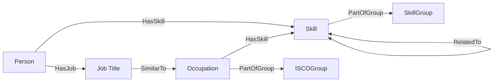

# Neo4J Database Model

## Schema visualization

## Node properties table
| Node       | Properties     | Description                                 |
|------------|----------------|---------------------------------------------|
| Skill      |                | Skills and competences                      |
| Skill      | preferredLabel | How the skill is named in our database      |
| Skill      | altLabels      | Other namings of the skill                  |
| Skill      | conceptUri     | Unique ID of the skill                      |
| Skill      | description    | Description                                 |
| Skill      | skillType      | Type of skill (e.g. Knowledge / competence) |
| SkillGroup |                | Categorization of skills (Taxonomy)         |
| SkillGroup | preferredLabel | How the skill is named in our database      |
| SkillGroup | conceptUri     | Unique ID of the skill                      |
| SkillGroup | description    | Description                                 |
| Person     |                | User of the app                             |
| Person     | name           | Name                                        |
| Person     | company        | Company                                     |
| Person     | id             | Unique ID                                   |
| Occupation |                | Standardized list of job titles             |
| Occupation | preferredLabel | How the occupation is named in our database |
| Occupation | altLabels      | Other namings of the occupation             |
| Occupation | conceptUri     | Unique ID of the occupation                 |
| Occupation | description    | Description                                 |
| ISCOGroup  |                | Categorization of job titles (Taxonomy)     |
| ISCOGroup  | preferredLabel | How the skill is named in our database      |
| ISCOGroup  | conceptUri     | Unique ID of the skill                      |
| ISCOGroup  | description    | Description                                 |
| JobTitle   |                | Actual job title of the user                |
| JobTitle   | label          | Label                                       |
| JobTitle   | id             | Unique ID                                   |

